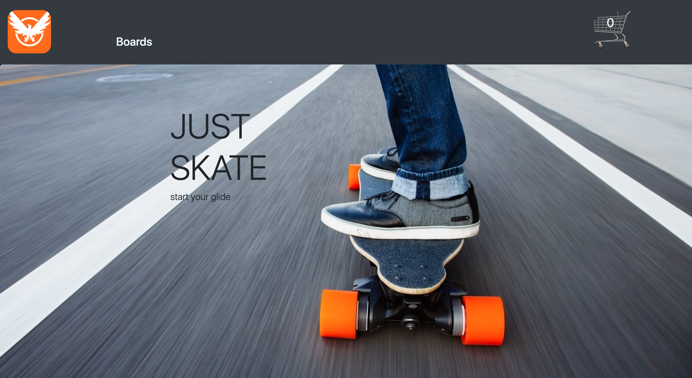

# GlideRight

   A full stack LAMP & React E commerce experience.
   Browse the top electric skateboard on the market, add products to cart
   Second guessing an item? No problem, navigate to your cart 
   and click delete. Picked one for yourself but wanted to share
   the love with a friend? No problem, update the number to purchase
   directly from your cart or just navigate back to the product
   page and add it there.After you decide on which skateboard you 
   want to purchase, click checkout from the shopping cart and fill,
   out all fields.Please remember this is only a demo site
# Project Tech Stack
- JavaScript
- React
- PHP
- MySQL
- Bootstrap
- OOP
- SQL
- CSS
- HTML
- apache2
- linux

# Initial Setup
1. Fork this repo and clone your fork from your terminal
   - Click on the Fork button, located at the top right of the page
